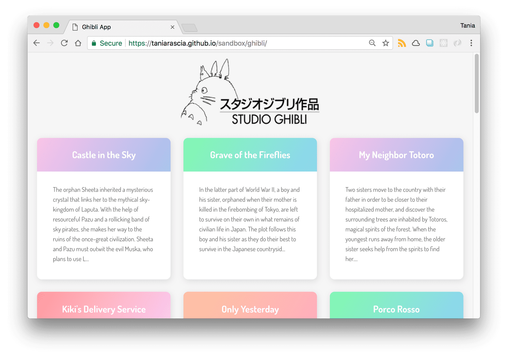

# studio_ghibli_client

This simple web app connects to a Studio Ghibli API, retrieves the data with JavaScript, and displays it on the front end of a website.

This is not meant to be an extensive resource on APIs or REST - just the simplest possible example to get up and running that you can build from in the future. We'll learn:

* What a Web API is.
* Learn how to use the HTTP request GET with JavaScript
* How create and display HTML elements with JavaScript.

It will look like this:

## Structure

The project consists of index.html, style.css, and scripts.js at the end. This HTML skeleton just links to a CSS and JavaScript file, loads in a font, and contains a div with a root id. This file is complete and will not change. We'll be using JavaScript to add everything from here out.

## Reference

[How to Connect to an API with JavaScript](https://www.taniarascia.com/how-to-connect-to-an-api-with-javascript/)
